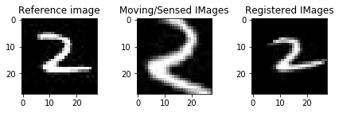

# Image-Alignment-using-CNN
Problem statement : Given two images 1. real image ; 2 distorted image. The task is to align the distorted image with respect to real image such that both images attain maximum similarity.

Approach : Dataset i have used in this project in MNIST image dataset. Loss function used is MSE loss.

How to reproduce the results
1. Download the dataset and store it in the data folder.
2. Run 10,000 iterations, you can change the hyperparameters if you want.
3. Select any two random images from the data set as test image
4. Check the results.

Note: You have to change the logic according to your needs.

Some results:

